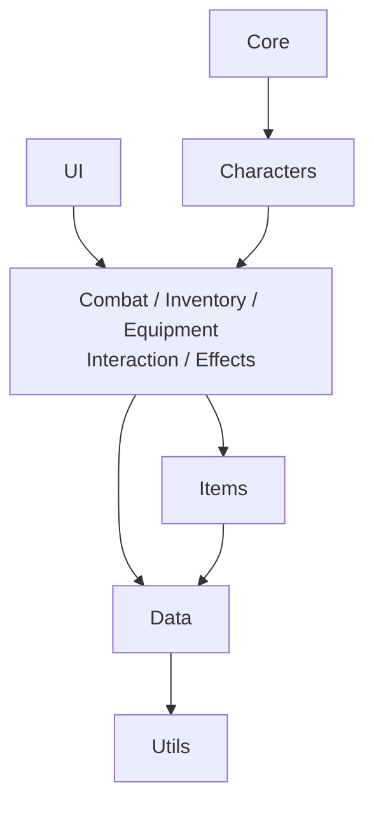
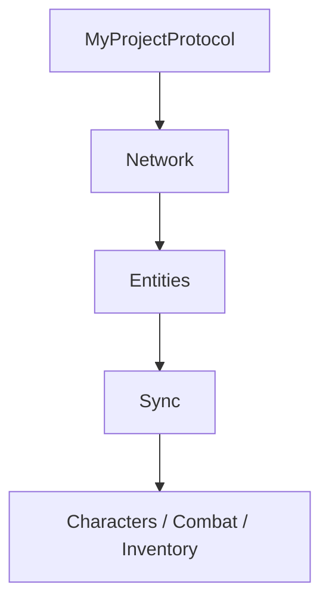
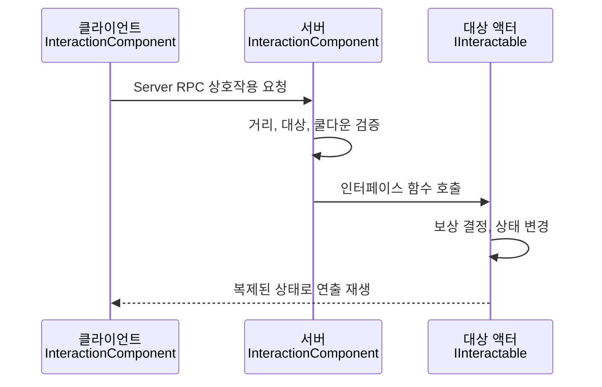
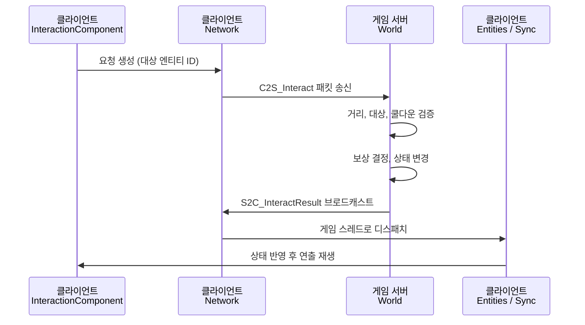

# MMORPG 스타터킷 폴더 구조 가이드라인

2026-09-18 · @Someone

개정 내역: 서버 모델(언리얼 데디케이티드 서버 / 외부 C++ 서버)에 따른 분기 구조를 추가했습니다. 서버 모델 결정을 1장의 최상위 분기로 올리고, 기존 7장(GAS)과 8장(멀티플레이)의 순서를 바꿔 7장을 서버 모델 분기로, 8장을 GAS 분기로 재배치했습니다.

## 1. 전제와 핵심 원칙

이 킷은 **C++ 중심, 직업 기반 MMORPG, 서버 모델과 GAS는 선택 사항**을 전제로 합니다. Content에는 보여지는 에셋과 데이터를, Source에는 게임 규칙을 둡니다.

### 킷의 전제

| 항목 | 전제 |
| --- | --- |
| 엔진 | Unreal Engine 5.8 (World Partition, Enhanced Input, StateTree, MetaSounds 사용 가능) |
| 로직 | C++ 중심. 블루프린트는 C++ 클래스를 상속한 설정용과 에디터 그래프 에셋에 한정 |
| 서버 모델 | A안(언리얼 데디케이티드 서버)을 기본으로 폴더를 두고, B안(외부 C++ 서버) 선택 시 7장의 절차를 따름 |
| 스킬 시스템 | GAS 사용을 기본으로 폴더를 두고, 미사용 시 삭제 또는 대체 경로를 따름 |
| 캐릭터 | 직업 기반. 직업마다 전용 메시, 애니메이션, 스킬 폴더를 가짐 |
| 범위 | 저장소 최상위 구조, Content 폴더 구조, Source 모듈 구조. B안 선택 시 서버 프로젝트의 최상위 구조까지 포함 |
| 소스 컨트롤 | Git(+LFS) 기준. 빈 폴더에는 `.gitkeep`을 둠 |

### 서버 모델 결정이 가장 앞에 옵니다

**서버 모델은 이 킷에서 가장 먼저, 그리고 단 한 번 결정하는 항목입니다.** 이 결정이 Source 폴더 구조, 권한 판정의 위치, GAS 채택 여부, 엔진을 직접 빌드할지 여부를 모두 구속하기 때문입니다.

| 구분 | A안 | B안 |
| --- | --- | --- |
| 이름 | 언리얼 데디케이티드 서버 | 외부 C++ 서버 |
| 권한 판정 위치 | 언리얼 게임 모듈 | 별도의 서버 프로젝트 |
| 클라이언트가 서버에 요청하는 방법 | Server RPC | 직렬화된 패킷 |
| 언리얼 리플리케이션 | 사용함 | 사용하지 않음 |
| 소스 빌드 엔진 | 필요함 | 필요하지 않음 |
| 서버 코드를 직접 작성하는 부담 | 작음 | 큼 |

결정 순서는 아래 세 단계를 지킵니다. 순서를 뒤집으면 뒤늦게 되돌려야 하는 작업이 생깁니다.

1. 서버 모델을 A안과 B안 중에서 정합니다.
2. GAS 사용 여부를 정합니다. B안을 택했다면 GAS의 이점이 크게 줄어들기 때문에, 1번의 결과가 이 결정을 제약합니다.
3. 나머지 항목(장비 장착 방식, 마스터 머티리얼 목록 등)을 정합니다.

### 장마다 서버 모델에 종속되는 정도가 다릅니다

아래 표에서 "무관"으로 표시된 장은 A안과 B안 어느 쪽을 택하든 그대로 씁니다. "종속"으로 표시된 장만 모델별로 갈라집니다.

| 장 | 서버 모델 종속 여부 |
| --- | --- |
| 1. 전제와 핵심 원칙 | 무관 |
| 2. 폴더 트리 | 저장소 최상위와 Source 트리는 종속, Content 트리는 거의 무관 |
| 3. 명명 규칙 | 무관. B안에서 생성 코드 예외 조항만 추가로 적용 |
| 4. Content 가이드 | 대부분 무관. AI 절과 Data 절만 종속 |
| 5. Source 가이드 | 종속 |
| 6. Content와 Source의 경계 | 대부분 무관 |
| 7. 서버 모델별 분기 | 종속 |
| 8. GAS 사용 여부에 따른 분기 | 7장의 결정에 종속 |
| 9. 에셋 배치 판단표 | 판단 순서와 기본 사례는 무관. B안 사례 표만 종속 |
| 10. 운영 규칙과 체크리스트 | 대부분 무관. 시작 체크리스트만 종속 |

### 분류 원칙

**Content는 대상 중심, Source는 도메인 중심으로 나눕니다.** 두 방식 모두 "함께 변경되는 것끼리 묶는다"는 같은 목표를 가집니다. Content에서는 몬스터 하나를 추가할 때 메시, 머티리얼, 애니메이션이 함께 바뀌므로 대상 단위로 묶습니다. Source에서는 데미지 공식을 고칠 때 여러 클래스가 함께 바뀌므로 게임 규칙 단위로 묶습니다.

**함께 지워져야 하는 것은 같은 폴더에, 여러 곳이 공유하는 것은 공용 폴더에 둡니다.** 어디에 둘지 애매하면 개별 폴더에 먼저 둡니다. 두 번째로 쓰이는 시점에 가장 가까운 `Common/`으로 올립니다.

**이름은 Content와 Source에서 같은 분류명을 씁니다.** `Content/.../Interactables`의 C++ 부모는 `Source/.../Interaction`에 있는 식으로, 한쪽 경로를 알면 다른 쪽을 바로 찾을 수 있어야 합니다.

**처음부터 모든 폴더를 채울 필요는 없습니다.** 킷의 폴더는 "여기에 둔다"는 약속입니다. 쓰지 않는 폴더는 비워 두거나 지워도 됩니다.

## 2. 폴더 트리

아래 트리가 킷의 기준입니다. 트리에 짧게 적힌 주석의 상세 규칙은 3장부터 설명합니다. 트리 주석의 `[B안]` 표시는 외부 C++ 서버를 택했을 때만 적용한다는 뜻입니다.

### 저장소 최상위

저장소의 최상위 구조는 서버 모델에 따라 달라집니다. **이 구조는 첫날에 정해서 만들고, 에셋과 코드가 쌓인 뒤에는 바꾸지 않습니다.**

A안에서는 언리얼 프로젝트가 곧 저장소입니다.

```
ProjectRoot/
├── MyProject.uproject
├── Content/
├── Source/
├── Config/
├── DesignData/                         # 기획 수치 원본 (CSV/JSON)
└── Tools/
```

B안에서는 언리얼 클라이언트와 게임 서버가 같은 저장소 안의 형제 폴더가 됩니다.

```
ProjectRoot/
├── Client/                             # 언리얼 프로젝트 (.uproject, Content/, Source/, Config/)
├── Server/                             # 외부 C++ 게임 서버
├── Protocol/                           # 클라이언트와 서버가 공유하는 패킷 계약
│   ├── Schema/                         # .proto 또는 .fbs 원본
│   ├── Generated/                      # 생성된 C++ 코드 (커밋함)
│   └── Generate.ps1 / Generate.sh      # 생성 스크립트
├── Shared/                             # 양쪽이 공유하는 순수 C++ (언리얼 타입에 의존하지 않음)
├── DesignData/                         # 기획 수치 원본. 클라이언트와 서버가 함께 읽음
└── Tools/                              # 임포트 도구, NavMesh 익스포트 산출물
```

`Server/`와 `Protocol/`, `Shared/`를 언리얼 프로젝트 **바깥에** 두는 이유는 두 가지입니다. 첫째, 언리얼의 쿠킹과 패키징 대상에서 자연히 제외됩니다. 둘째, 서버를 빌드할 때 언리얼 빌드 도구가 필요 없어집니다.

**하나의 저장소로 시작하는 것을 권합니다.** 클라이언트와 서버를 별도 저장소로 나누면 패킷 계약을 바꿀 때마다 두 저장소의 커밋을 짝지어 관리해야 합니다. 개인 프로젝트에서는 이 비용이 이득보다 큽니다.

### Content

```
Content/
├── MyProject/                          # 새 프로젝트 시작 직후 에디터에서 이름 변경
│   ├── Core/
│   │   ├── GameModes/                  # C++ GameMode/GameState를 상속한 설정용 BP
│   │   ├── Player/                     # PlayerController, PlayerState BP
│   │   └── Input/                      # IA_, IMC_
│   ├── Characters/
│   │   ├── Common/                     # 공용 스켈레톤, 베이스 ABP, 공용 애니메이션
│   │   ├── Player/
│   │   │   ├── Common/                 # 직업 공용: 커스터마이징 파츠, 공용 모션
│   │   │   └── Classes/
│   │   │       └── _Template/          # Meshes/Materials/Textures/Animations
│   │   ├── Monsters/
│   │   │   ├── Common/
│   │   │   ├── Bosses/
│   │   │   └── _Template/
│   │   └── NPCs/
│   │       ├── Common/
│   │       └── _Template/
│   ├── AI/                             # BT_, BB_, STT_, EQS_ / [B안] 폴더 삭제
│   │   ├── Common/
│   │   └── Monsters/
│   ├── Abilities/                      # GAS 미사용 시: 폴더 삭제, 스킬 정의는 Data/DataAssets로
│   │   ├── Common/
│   │   ├── Classes/
│   │   │   └── _Template/
│   │   ├── Monsters/
│   │   └── Cues/                       # GAS 미사용 시: 이펙트는 VFX에서 직접 호출
│   ├── Items/
│   │   ├── Equipment/
│   │   │   ├── Weapons/
│   │   │   └── Armors/
│   │   ├── Consumables/
│   │   ├── Misc/
│   │   ├── Pickups/
│   │   └── Icons/
│   ├── Interactables/
│   │   ├── Common/
│   │   ├── Chests/
│   │   ├── Doors/
│   │   ├── Portals/
│   │   └── GatheringNodes/
│   ├── UI/
│   │   ├── Common/
│   │   ├── Styles/
│   │   ├── Frontend/
│   │   ├── HUD/
│   │   └── Inventory/
│   ├── Data/
│   │   ├── DataTables/
│   │   ├── DataAssets/
│   │   ├── Curves/
│   │   └── StringTables/
│   ├── Maps/
│   │   ├── Frontend/
│   │   ├── Zones/
│   │   │   └── _Template/              # DataLayers/HLOD/LevelInstances/Cinematics
│   │   ├── Dungeons/
│   │   │   └── _Template/              # Props/Gimmicks/Cinematics
│   │   └── Test/
│   ├── Materials/
│   │   ├── Master/
│   │   └── Functions/
│   ├── Environment/
│   │   ├── Architecture/
│   │   ├── Props/
│   │   ├── Foliage/
│   │   └── Landscape/
│   ├── VFX/
│   │   ├── Common/
│   │   ├── Combat/
│   │   └── Environment/
│   └── Audio/
│       ├── Music/
│       ├── SFX/
│       ├── MetaSounds/
│       └── Settings/
├── External/
└── Developers/
```

### Source

```
Source/
├── MyProject.Target.cs
├── MyProjectEditor.Target.cs
├── MyProjectServer.Target.cs           # 데디케이티드 서버 빌드 (소스 빌드 엔진 필요)
│                                       # [B안] 파일 삭제
├── MyProject/                          # 런타임 게임 모듈
│   ├── MyProject.Build.cs              # GAS 미사용 시: GameplayAbilities 등 의존성 제거
│   ├── MyProject.h / .cpp
│   ├── Core/
│   │   ├── GameModes/
│   │   ├── Player/
│   │   └── Input/
│   ├── Characters/
│   │   ├── Common/
│   │   ├── Player/
│   │   ├── Monsters/
│   │   └── NPCs/
│   ├── AI/                             # [B안] 폴더 삭제. 몬스터 AI는 서버 프로젝트로 이동
│   ├── Abilities/                      # GAS 미사용 시: 폴더 삭제, 스킬 실행은 Combat/Skills로
│   │   ├── Tasks/
│   │   └── Base/
│   ├── Combat/                         # [B안] 판정 코드 삭제, 연출 재생과 요청 생성만 남김
│   │   ├── Damage/
│   │   ├── HitDetection/
│   │   ├── Targeting/
│   │   └── Attributes/                 # GAS: AttributeSet / 미사용: 스탯 컴포넌트
│   ├── Effects/
│   ├── Items/
│   ├── Inventory/
│   ├── Equipment/
│   ├── Interaction/
│   ├── Network/                        # [B안] 소켓, 세션, 송수신, 패킷 디스패치
│   ├── Sync/                           # [B안] 원격 개체 보간, 로컬 예측과 서버 보정, 서버 시간
│   ├── Entities/                       # [B안] 서버 엔티티 ID와 로컬 액터의 대응 관리
│   ├── UI/
│   ├── Data/
│   ├── Online/                         # 로그인, 캐릭터 목록 / [B안] 비실시간 통신만 담당
│   └── Utils/
├── MyProjectProtocol/                  # [B안] 생성된 패킷 코드를 감싸는 모듈
│   ├── MyProjectProtocol.Build.cs      # bUseRTTI, bEnableExceptions 설정이 필요할 수 있음
│   └── Generated/                      # Protocol/Generated/를 심볼릭 링크 또는 복사로 연결
└── MyProjectEditor/                    # 에디터 전용 모듈 (패키징 제외)
    ├── MyProjectEditor.Build.cs
    ├── MyProjectEditor.h / .cpp
    ├── Validation/
    └── Tools/                          # [B안] NavMesh 익스포트, 데이터 버전 계산 도구 추가
```

### Server (B안 전용)

A안을 택했다면 아래 트리는 만들지 않습니다. 서버는 언리얼 프로젝트의 빌드 체계와 무관하므로 CMake처럼 익숙한 빌드 도구를 씁니다.

```
Server/
├── CMakeLists.txt
├── src/
│   ├── Net/                            # 소켓, 세션, 수신 루프, 패킷 디스패치
│   ├── World/                          # 존, 엔티티, 스폰, 시야 관리(AOI)
│   ├── Combat/                         # 데미지 계산, 피격 판정, 쿨다운
│   ├── Inventory/                      # 인벤토리, 장비, 거래, 제작
│   ├── AI/                             # 몬스터 행동 결정, 길찾기
│   ├── Data/                           # DesignData 로더, 데이터 버전 계산
│   ├── Db/                             # 영속화 계층
│   └── Main.cpp
└── tests/
```

`Server/src/`의 분류명은 언리얼 `Source/`의 분류명과 맞춥니다. 3장의 "이름은 Content와 Source에서 같은 분류명을 씁니다"라는 원칙을 서버까지 넓힌 것입니다. 데미지 공식을 고칠 때 `Server/src/Combat/`과 `Source/MyProject/Combat/`을 함께 열게 되기 때문입니다.

## 3. 명명 규칙

폴더와 에셋 이름은 **영어, 공백 없음, PascalCase**로 짓습니다. 한글이나 공백이 들어간 경로는 패키징, 쿠킹, Git LFS, Perforce에서 문제를 일으키기 쉽습니다.

### 폴더 이름

- **복수형으로 통일합니다.** `Monsters`, `Weapons`, `Armors`, `NPCs`처럼 담는 대상이 여럿인 폴더는 복수형입니다. 단, `Core`, `Data`, `Audio`, `UI`처럼 개념 이름인 폴더는 그대로 둡니다.
- **`Common/`은 그 폴더 안에서 공유되는 것만 담습니다.** `Characters/Common`은 모든 캐릭터가, `Characters/Player/Common`은 모든 직업이 공유하는 것입니다.
- **`_Template/`은 복사해서 쓰는 틀입니다.** 에디터에서 복제한 뒤 실제 이름(예: `Warrior`)으로 바꿉니다. 원본 `_Template`에는 에셋을 넣지 않습니다. 밑줄 덕분에 콘텐츠 브라우저 맨 위에 정렬됩니다.
- **프로젝트 루트 이름 `MyProject`는 킷 사용 첫날 한 번만 바꿉니다.** 에셋이 쌓인 뒤에 바꾸면 리다이렉터 정리와 C++ 경로 수정이 커집니다.

### 에셋 접두사

| 접두사 | 에셋 | 접두사 | 에셋 |
| --- | --- | --- | --- |
| BP\_ | 블루프린트 | WBP\_ | 위젯 블루프린트 |
| ABP\_ | 애니메이션 블루프린트 | ALI\_ | 애니메이션 레이어 인터페이스 |
| SK\_ / SM\_ | 스켈레탈 / 스태틱 메시 | SKEL\_ / PHYS\_ | 스켈레톤 / 피직스 에셋 |
| AM\_ / BS\_ / A\_ | 몽타주 / 블렌드 스페이스 / 애니메이션 시퀀스 | CR\_ | 컨트롤 릭 |
| M\_ / MI\_ / MF\_ | 머티리얼 / 인스턴스 / 함수 | T\_ | 텍스처 |
| NS\_ | 나이아가라 시스템 | MS\_ / SC\_ | MetaSound 소스 / 사운드 클래스 |
| DT\_ / DA\_ | 데이터 테이블 / 데이터 에셋 | CT\_ / ST\_ | 커브 테이블 / 스트링 테이블 |
| GA\_ / GE\_ / GC\_ | 어빌리티 / 이펙트 / 큐 | IA\_ / IMC\_ | 입력 액션 / 매핑 컨텍스트 |
| BT\_ / BB\_ | 비헤이비어 트리 / 블랙보드 | STT\_ / EQS\_ | StateTree / EQS 쿼리 |
| L\_ | 레벨 | LS\_ | 레벨 시퀀스 |
| DL\_ / HLOD\_ | 데이터 레이어 / HLOD 레이어 | LI\_ / PLA\_ | 레벨 인스턴스 / 패킹 레벨 액터 |

StateTree는 스트링 테이블(`ST_`)과 겹치지 않도록 `STT_`를 씁니다.

### 텍스처 접미사

텍스처는 접두사 뒤에 용도 접미사를 붙입니다. `T_Goblin_Body_D`, `T_Goblin_Body_N`처럼 짓습니다.

| 접미사 | 용도 |
| --- | --- |
| \_D | 베이스 컬러 (Diffuse / Albedo) |
| \_N | 노멀 |
| \_ORM | Occlusion, Roughness, Metallic 채널 패킹 |
| \_E | 이미시브 |
| \_M | 마스크 |

### C++ 이름

- 파일 이름은 접두사 없이 `MonsterCharacter.h`, 클래스 이름은 언리얼 규칙대로 `AMonsterCharacter`로 짓습니다.
- 게임 모듈의 클래스에는 프로젝트 약어 접두사를 붙이는 것을 권합니다. 예: `AMPMonsterCharacter`. 엔진과 플러그인 클래스 이름과의 충돌을 막습니다.
- 로그 카테고리, 게임플레이 태그 루트도 프로젝트 약어로 시작합니다. 예: `LogMP`, `MP.Combat.Damage.Fire`.

### 생성 코드의 예외 (B안)

- **`Protocol/Generated/`와 `Source/MyProjectProtocol/Generated/`의 파일에는 위의 C++ 이름 규칙을 적용하지 않습니다.** 생성기가 스키마 파일 이름을 그대로 따르므로 사람이 규칙을 강제할 수 없습니다.
- 5장의 에디터 검증기와 코드 서식 도구에서 이 두 경로를 제외 목록에 넣습니다.
- 패킷 이름은 방향을 접두사로 드러냅니다. 클라이언트가 보내면 `C2S_`, 서버가 보내면 `S2C_`로 시작합니다. 예: `C2S_UseSkill`, `S2C_SkillResult`.
- 스키마 파일은 도메인 단위로 나눕니다. 예: `Combat.proto`, `Inventory.proto`. 파일 하나에 전부 넣으면 한 줄을 고칠 때마다 전체가 다시 생성됩니다.

## 4. Content 가이드

Content의 에셋은 **보여지는 것, 데이터, 에디터 그래프로 조립하는 것** 세 종류뿐입니다. 여러 시스템이 호출하는 로직이 블루프린트에 생기면 Source로 옮길 대상으로 봅니다.

### Core

- 여기의 블루프린트는 **C++ 클래스를 상속하고 디테일 패널 값만 채운 설정용**입니다. 기본 폰 클래스, HUD 클래스, 기본 입력 컨텍스트 같은 에셋 참조를 지정합니다.
- GameMode는 서버에만 존재하므로 규칙 판정용 설정을, GameState는 모든 클라이언트에 복제되는 공유 상태 설정을 둡니다.
- PlayerState는 폰이 사라져도 유지되므로 레벨, 파티, 길드 같은 지속 정보의 자리입니다.
- `Input/`의 매핑 컨텍스트는 상황별로 나눕니다. 예: `IMC_Combat`, `IMC_UI`, `IMC_Mount`. 우선순위를 바꿔 입력을 전환합니다.

### Characters

- **캐릭터 하나가 폴더 하나로 완결되게** 만듭니다. 전용 메시, 머티리얼 인스턴스, 텍스처, 애니메이션을 그 폴더에 모두 둡니다.
- `Characters/Common`의 공용 스켈레톤을 최대한 공유합니다. 스켈레톤이 같으면 애니메이션과 애님 블루프린트를 재사용할 수 있습니다. 체형이 다른 몬스터는 IK 리타기팅으로 공유 애니메이션을 옮깁니다.
- 베이스 ABP는 공통 로코모션만 담습니다. 직업별 차이는 \*\*애니메이션 레이어 인터페이스(ALI\_)\*\*로 끼워 넣어 ABP 복제를 피합니다.
- `Player/Common`에는 직업을 가리지 않는 커스터마이징 파츠(얼굴, 헤어)와 공용 모션(감정표현, 채집)을 둡니다.
- `Bosses/`는 일반 몬스터와 달리 페이즈 연출, 전용 패턴 에셋이 많아 분리합니다. 보스 폴더도 `_Template` 구조를 따릅니다.
- 직업 추가 절차: `Player/Classes/_Template`과 `Abilities/Classes/_Template`을 복제해 같은 이름으로 바꾸고, `Data/DataAssets`에 직업 설정 DA를 만듭니다.

### AI

- 몬스터와 NPC가 공유하는 Behavior Tree, Blackboard, StateTree, EQS 쿼리를 둡니다. 태스크와 조건 노드 자체는 Source/AI의 C++입니다.
- 특정 보스 전용 AI는 그 보스 폴더에 둡니다. 두 번째 보스가 쓰기 시작하면 `AI/Monsters`로 올립니다.
- AI 판단은 서버에서만 실행됩니다. 클라이언트에 필요한 것은 결과 상태(이동, 몽타주 재생)뿐입니다.
- **[B안] 이 폴더 전체를 만들지 않습니다.** 외부 서버가 몬스터의 행동을 결정하므로 Behavior Tree와 StateTree 에셋을 쓸 자리가 없습니다. 클라이언트는 서버가 보내는 이동 목표와 몽타주 재생 명령만 받습니다. 길찾기도 서버가 맡으므로, 언리얼에서 만든 NavMesh를 서버가 읽을 형식으로 내보내는 도구가 `MyProjectEditor/Tools/`에 필요합니다.

### Abilities

- GA\_는 스킬 동작, GE\_는 수치 변화(데미지, 버프), GC\_는 연출입니다. 공통 동작은 Source의 베이스 GA에 있고, 여기의 GA\_는 그것을 상속해 값과 몽타주를 채운 얇은 BP입니다.
- **"기절" 같은 공용 효과는 `Common/`에 둡니다.** 직업, 몬스터, 함정이 같은 GE를 참조합니다.
- `Cues/`는 GameplayCue 스캔 경로를 제한하기 위해 한곳에 모읍니다. `DefaultGame.ini`의 `GameplayCueNotifyPaths`에 이 경로를 지정합니다.
- GAS 미사용 시 처리는 8장을 따릅니다.

### Items

- 아이템의 **외형**만 둡니다. 공격력, 가격, 드롭률 같은 수치는 `Data/`에 둡니다.
- 장비는 캐릭터 스켈레톤에 맞춘 스켈레탈 메시로 만들고, 공용 스켈레톤을 기준으로 리깅합니다. 장착 방식(소켓 부착, 파츠 교체)은 킷 사용 초기에 한 가지로 정합니다.
- `Pickups/`에는 월드에 떨어진 아이템을 표현하는 BP를 둡니다. 보통 BP 하나가 데이터 행 ID를 받아 외형을 바꾸는 방식이라 아이템마다 BP를 만들지 않습니다.
- `Icons/`의 텍스처는 텍스처 그룹을 UI로, 밉맵을 끔(NoMipmaps)으로, 압축을 UserInterface2D로 일괄 설정합니다. 크기는 하나로 통일합니다(예: 128x128).
- 아이템 에셋은 **소프트 참조**로 불러옵니다. 데이터 테이블이 수천 개 메시를 하드 참조하면 테이블 하나 로드에 전부 메모리에 올라갑니다.

### Interactables

- 여러 맵에 배치되는 범용 상호작용 오브젝트만 둡니다. NPC는 `Characters/NPCs`, 떨어진 아이템은 `Items/Pickups`, 특정 던전 전용 기믹은 그 맵 폴더에 둡니다.
- `Common/`의 베이스 BP는 C++ 인터페이스(`IInteractable`)를 구현한 부모를 상속합니다. 하이라이트용 포스트 프로세스 머티리얼도 여기에 둡니다.
- 여기의 BP는 **연출만** 담당합니다. 뚜껑 열림, 문 회전, 채집물 소멸 효과가 그 예입니다. 보상과 성공 여부는 서버가 결정합니다.

### UI

- 위젯의 동작은 C++ `UUserWidget` 서브클래스에 두고, WBP\_는 레이아웃과 애니메이션만 담당합니다. C++에서는 `BindWidget`으로 WBP의 요소를 받습니다.
- `Common/`의 작은 위젯(버튼, 슬롯, 툴팁)을 먼저 만들고 모든 창이 이를 조합합니다. `Styles/`에는 폰트 에셋과 공용 UI 텍스처, 스타일 데이터를 둡니다.
- `Frontend/`는 월드 입장 전 화면(로그인, 서버 선택, 캐릭터 선택), `HUD/`는 플레이 중 상시 표시 요소(체력바, 스킬바, 미니맵, 상호작용 프롬프트)입니다.
- 새 기능 창은 `UI/<기능명>/`으로 추가합니다. 예: `UI/Quest`, `UI/Party`, `UI/Chat`.
- UI 텍스트는 직접 입력하지 않고 `Data/StringTables`를 참조합니다.

### Data

- **DataTable**은 같은 구조의 행이 많은 데이터(아이템, 몬스터, 드롭 테이블)에 씁니다. 행 구조체는 반드시 C++ `USTRUCT`로 만듭니다. 블루프린트 구조체는 필드 수정 시 참조 에셋이 깨지는 문제가 잦습니다.
- **DataAsset**은 구조가 복잡하고 에셋 참조가 많은 설정 하나에 씁니다(직업 설정, 인벤토리 설정). `UPrimaryDataAsset`을 쓰면 Asset Manager로 비동기 로드와 쿠킹 규칙을 관리할 수 있습니다.
- **Curves**는 레벨별 경험치, 스탯 성장처럼 입력값에 따라 연속으로 변하는 수치에 씁니다.
- **StringTables**는 게임 내 모든 표시 텍스트의 원본입니다. 처음부터 쓰면 로컬라이제이션 때 전수 조사가 필요 없습니다.
- **수치의 원본 파일은 Content 밖에 둡니다.** 저장소 최상위의 `DesignData/`에 CSV나 JSON으로 두고 DataTable로 임포트합니다. Git에서 변경 이력이 보이고, 외부 서버를 만들 때 같은 원본을 공유할 수 있습니다.
- **[B안] 클라이언트와 서버가 같은 데이터를 읽고 있는지 접속 시점에 확인합니다.** 클라이언트는 `DesignData/`를 DataTable로 임포트하고 서버는 원본 파일을 직접 읽으므로, 한쪽만 갱신된 상태로 접속하면 수치가 어긋납니다. 임포트 도구가 `DesignData/` 전체의 해시를 계산해 `DataVersion` 문자열로 기록하고, 클라이언트가 접속 핸드셰이크에 이 값을 실어 보냅니다. 서버는 자기 값과 다르면 접속을 거부하고 사유를 돌려줍니다.
  - 이 검증이 없으면 "내 화면에서는 데미지가 100인데 서버는 80으로 계산한다" 같은 증상이 남는데, 재현 조건이 개발자의 작업 사본마다 달라서 원인을 찾기가 매우 어렵습니다.

### Maps

- **맵마다 폴더를 하나씩** 둡니다. 레벨 옆에 딸린 파일(BuiltData, 랜드스케이프 레이어 정보, 데이터 레이어, HLOD 레이어, 컷신)이 함께 모이게 하려는 것입니다. Frontend와 Test의 가벼운 맵은 폴더 없이 레벨만 둬도 됩니다.
- `Zones/`는 World Partition 오픈월드, `Dungeons/`는 별도 로드되는 인스턴스 레벨입니다. 이 구분은 서버 운영의 필드 서버와 던전 인스턴스 구분과 맞춥니다.
- `L_MapName_BuiltData`, `L_MapName_sharedassets/`는 에디터가 자동으로 만듭니다. 직접 편집하지 않지만 소스 컨트롤에는 포함합니다.
- World Partition 레벨은 `Content/__ExternalActors__/`, `Content/__ExternalObjects__/`에 액터별 파일을 저장합니다. 맵 경로를 그대로 따르므로 **맵 이동은 반드시 에디터에서** 합니다.
- 맵 전용 기믹과 소품은 맵 폴더에 두고, 두 번째 맵에서 쓰이면 `Interactables/`나 `Environment/`로 올립니다.
- `Test/`에는 기능별 테스트 맵을 둡니다(`L_Test_Combat`, `L_Test_Interaction`). 패키징 대상 맵 목록에서는 제외합니다.

### Materials

- **마스터 머티리얼(M\_)과 머티리얼 함수(MF\_)만** 둡니다. 개별 에셋용 머티리얼 인스턴스(MI\_)는 해당 에셋 폴더에 둡니다.
- 마스터 머티리얼은 용도별로 소수만 유지합니다. 예: 캐릭터, 환경, 폴리지, UI, 이펙트. 수가 늘수록 셰이더 컴파일 시간과 셰이더 순열이 커집니다.
- 인스턴스에서 스태틱 스위치를 남발하면 순열이 급증합니다. 자주 쓰는 조합은 별도 마스터로 분리하는 편이 낫습니다.

### Environment

- 월드 구성용 배경 에셋입니다. 용량과 개수가 가장 큰 영역이라 캐릭터, 아이템과 섞지 않습니다.
- 지역 테마가 뚜렷해지면 하위에 테마 폴더를 둡니다. 예: `Environment/Props/Forest`.
- 대량 배치되는 스태틱 메시는 Nanite 사용 여부와 LOD 설정을 에셋 추가 시점에 정합니다.

### VFX

- 나이아가라 시스템과 이펙트 전용 머티리얼, 텍스처를 둡니다. 스킬 연출은 GameplayCue(또는 8장의 대체 경로)가 이 폴더의 에셋을 재생합니다.
- 이펙트마다 스케일러빌리티(Effect Type 에셋)를 지정합니다. 다수 플레이어가 모이는 MMORPG에서 거리와 개수에 따라 이펙트를 줄이는 기준이 됩니다.

### Audio

- `MetaSounds/`에는 MetaSound 소스와 패치를, `Settings/`에는 사운드 클래스, 사운드 믹스, 감쇠, 동시 재생(Concurrency) 설정을 둡니다.
- 스킬과 피격 효과음에는 반드시 동시 재생 제한을 겁니다. 레이드에서 효과음이 수십 개 겹치는 문제를 막습니다.

### External

- Fab, 마켓플레이스 에셋은 설치 시 `Content/` 루트에 자기 경로로 들어옵니다. 설치된 위치는 **평가 공간**으로 봅니다.
- 사용이 확정되면 필요한 에셋만 **에디터 안에서** `External/<팩이름>/`으로 옮기고 리다이렉터를 정리합니다. 원본 팩 폴더는 삭제합니다.
- 원래 팩을 다시 업데이트하면 루트에 새로 설치되므로, 외부 에셋 업데이트는 수동 병합으로 처리합니다.
- 외부 에셋을 직접 크게 수정해야 하면 `MyProject/` 안의 해당 분류로 옮겨 내 에셋으로 취급합니다.

### Developers

- 개인 실험 공간입니다. `Developers/<이름>/` 아래에 둡니다.
- 게임 에셋이 이 폴더를 참조하면 안 됩니다. 쓸 만한 결과물은 정식 폴더로 옮긴 뒤 참조합니다.
- 콘텐츠 브라우저 설정의 Show Developers Content로 표시 여부를 켜고 끕니다. 패키징 설정에서 쿠킹 제외 경로로 지정합니다.

## 5. Source 가이드

Source는 **런타임 모듈 하나와 에디터 모듈 하나**로 시작합니다. 폴더는 게임 규칙 단위로 나누고, 도메인이 충분히 커지면 그때 별도 모듈로 분리합니다.

### 타겟 파일

| 파일 | 빌드 결과 | 비고 |
| --- | --- | --- |
| `MyProject.Target.cs` | 클라이언트 겸 리슨 서버 게임 | `Type = TargetType.Game` |
| `MyProjectEditor.Target.cs` | 에디터 | 에디터 모듈을 포함 |
| `MyProjectServer.Target.cs` | 데디케이티드 서버 | 런처 엔진으로는 빌드 불가, 소스 빌드 엔진 필요 |

- 서버 타겟은 킷에 미리 두되, 소스 빌드 엔진을 준비하기 전까지는 에디터의 PIE 넷 모드(Play As Client)로 멀티플레이를 검증합니다.
- 순수 클라이언트 전용 빌드가 필요해지면 `MyProjectClient.Target.cs`를 추가합니다.
- **[B안] `MyProjectServer.Target.cs`를 삭제합니다.** 게임 서버가 언리얼 밖에 있으므로 데디케이티드 서버 타겟을 빌드할 이유가 없습니다. 소스 빌드 엔진도 준비하지 않아도 되므로, 엔진을 직접 빌드하는 데 드는 시간과 디스크 용량이 통째로 사라집니다. 이 점은 B안을 택했을 때 얻는 가장 확실한 이득입니다.
- **[B안] 대신 `MyProjectClient.Target.cs`를 처음부터 둡니다.** 클라이언트는 서버 기능을 전혀 담지 않으므로 클라이언트 전용 빌드가 기본 배포 형태가 됩니다.

### 모듈 구성

- **`MyProject`**: 런타임 게임 모듈입니다. 게임, 클라이언트, 서버 빌드에 모두 들어갑니다.
- **`MyProjectEditor`**: 에디터 전용 모듈입니다. `.uproject`에서 `Type`을 `Editor`로 지정해 패키징에서 제외합니다. 런타임 모듈은 에디터 모듈을 절대 참조하지 않습니다.
- 게임 모듈은 Public/Private 분리 없이 도메인 폴더에 `.h`와 `.cpp`를 함께 둡니다. 다른 모듈에 공개할 API가 생기는 시점에 그 모듈만 Public/Private으로 나눕니다.
- 모듈 분리 기준: 한 도메인이 다른 도메인에 거의 의존하지 않고, 컴파일 시간이 문제가 될 만큼 커졌을 때. 예: `MyProjectCombat`, `MyProjectOnline`. 초기에는 분리하지 않습니다.

### Build.cs 의존성

기본 의존성은 아래로 시작하고, 필요할 때 추가합니다.

| 분류 | 모듈 | A안 | B안 |
| --- | --- | --- | --- |
| 기본 | Core, CoreUObject, Engine, InputCore | 유지 | 유지 |
| 입력 | EnhancedInput | 유지 | 유지 |
| 태그 | GameplayTags | 유지 | 유지 |
| GAS | GameplayAbilities, GameplayTasks | 사용 여부에 따름 | 제거 권장 |
| AI | AIModule, NavigationSystem, StateTreeModule, GameplayStateTreeModule | 유지 | 제거 |
| UI | UMG, Slate, SlateCore | 유지 | 유지 |
| 리플리케이션 | NetCore (Iris 등 도입 시 추가) | 유지 | 제거 |
| 소켓 통신 | Sockets, Networking | 필요 없음 | 추가 |
| 패킷 계약 | MyProjectProtocol (프로젝트 모듈) | 필요 없음 | 추가 |

GAS 미사용이어도 **GameplayTags는 남깁니다.** 상태, 데미지 타입, 상호작용 종류를 태그로 표현하면 enum보다 확장이 쉽습니다. B안에서도 마찬가지입니다. 다만 서버와 태그 문자열을 주고받을 때는 태그 이름을 그대로 보내지 않고 정수 ID로 변환해 보냅니다. 문자열을 매 패킷에 싣는 비용이 크기 때문입니다.

**[B안] 직렬화 라이브러리의 빌드 설정을 먼저 확인합니다.** 언리얼은 기본으로 RTTI와 예외를 끄고 빌드합니다(`bUseRTTI = false`, `bEnableExceptions = false`). Protobuf처럼 둘 중 하나를 요구하는 라이브러리를 쓰려면 `MyProjectProtocol.Build.cs`에서 해당 설정을 켜야 하고, 그러면 그 모듈의 컴파일 조건이 나머지 모듈과 달라집니다. FlatBuffers나 직접 만든 직렬화기처럼 의존성이 가벼운 쪽을 고르면 이 문제를 피할 수 있습니다. 어느 쪽을 고르든 **패킷 계약을 별도 모듈로 분리해서** 이 설정 차이가 게임 모듈로 번지지 않게 막습니다.

### 도메인 폴더

- **Core**: GameMode, GameState, PlayerController, PlayerState, 입력 바인딩. Content의 Core BP가 이 클래스를 상속합니다.
- **Characters**: 베이스 캐릭터와 플레이어, 몬스터, NPC 캐릭터 클래스. 직업은 **클래스가 아니라 데이터로** 구분합니다. `APlayerCharacter` 하나가 직업 DataAsset을 읽어 메시, 스킬, 스탯을 적용합니다. 직업마다 C++ 클래스를 만들지 않습니다.
- **AI**: AIController, BT 태스크/데코레이터/서비스, StateTree 태스크와 조건, EQS 제너레이터.
- **Abilities**: GAS의 범용 기반입니다. `Base/`에 쿨다운, 코스트, 발동 조건을 처리하는 베이스 GA를, `Tasks/`에 AbilityTask를 둡니다. 개별 스킬 클래스는 여기에 만들지 않고 Content의 BP로 만듭니다.
- **Combat**: 전투 도메인입니다. `Damage/`는 데미지 계산과 데미지 타입, `HitDetection/`은 피격 판정과 서버 검증, `Targeting/`은 타겟 선택, `Attributes/`는 전투 스탯입니다.
- **Effects**: 버프와 상태이상 처리입니다. 경험치 버프, 휴식 보너스처럼 전투와 무관한 효과도 여기서 처리하므로 Combat 밖에 둡니다.
- **Items**: 아이템 정의(정적 데이터 참조)와 아이템 인스턴스(강화 수치, 내구도처럼 개체마다 다른 상태)를 구분해 둡니다.
- **Inventory / Equipment**: 인벤토리 컴포넌트, 장비 컴포넌트, 슬롯 규칙. 둘은 서로 호출하지만 장비 없이도 인벤토리가 동작하도록 분리합니다.
- **Interaction**: `IInteractable` 인터페이스, 플레이어 쪽 `InteractionComponent`, 상호작용 선택지 구조체, 상호작용 태그.
- **UI**: `UUserWidget` 베이스 클래스와 뷰모델. UI는 게임 도메인을 읽기만 하고, 게임 도메인은 UI를 참조하지 않습니다.
- **Data**: DataTable 행 `USTRUCT`, `UPrimaryDataAsset` 서브클래스, Asset Manager 설정 코드.
- **Online**: 로그인, 캐릭터 목록, 백엔드 API 통신. 요청 하나에 응답 하나로 끝나는 비실시간 통신만 담습니다. B안에서도 이 정의는 그대로 유지하고, 실시간 게임 트래픽은 아래의 `Network/`가 맡습니다.
- **Utils**: 함수 라이브러리, 로그 카테고리 선언, 공용 매크로. 도메인 로직은 넣지 않습니다.

### B안에서만 만드는 도메인 폴더

A안을 택했다면 아래 세 폴더를 만들지 않습니다. 언리얼의 리플리케이션이 같은 일을 대신하기 때문입니다.

- **Network**: 소켓 연결, 세션 수명 관리, 송수신 버퍼, 재접속 처리를 담습니다. 수신은 별도 스레드에서 하고, 게임 스레드로 넘기는 큐를 여기에 둡니다. 패킷 종류마다 처리 함수를 연결하는 디스패치 표도 이 폴더에 있습니다.
- **Sync**: 서버가 보낸 상태를 화면에 반영하는 규칙을 담습니다. 원격 개체의 위치 보간, 내 캐릭터의 로컬 예측과 서버 보정, 서버 시간과 클라이언트 시간의 차이 추정이 여기에 속합니다. **판정은 하지 않고 표현만 맞춥니다.**
- **Entities**: 서버가 부여한 엔티티 ID와 언리얼 액터를 짝지어 관리합니다. 시야에 들어온 개체를 스폰하고 나간 개체를 없애는 일을 맡습니다. A안의 리플리케이션 액터 채널이 하던 역할을 대신하는 자리입니다.

세 폴더는 서로 한 방향으로만 참조합니다. `Network`가 받은 패킷을 `Entities`가 해석해 액터를 만들고, `Sync`가 그 액터의 표현을 보정합니다. 반대 방향으로는 참조하지 않습니다.

### 의존 방향

도메인끼리 서로 참조하면 모듈 분리가 불가능해집니다. 아래 방향으로만 참조합니다.



화살표는 "참조한다"는 뜻입니다. 같은 층의 도메인끼리 호출이 필요하면 인터페이스나 델리게이트, 게임플레이 태그 이벤트로 연결합니다.

B안에서는 아래 세 층이 위 그림의 가장 아래에 붙습니다. 방향은 한쪽으로만 흐릅니다.



**게임 도메인은 `Network/`를 직접 참조하지 않습니다.** 요청을 보낼 때도 도메인이 소켓을 직접 다루지 않고, 요청 자료형을 만들어 `Network/`에 넘기는 인터페이스만 호출합니다. 이 경계가 무너지면 통신 방식을 바꿀 때 게임 코드 전체를 함께 고쳐야 합니다.

### MyProjectEditor

- **Validation**: `UEditorValidatorBase`를 상속한 검증기를 둡니다. 접두사 규칙 위반, `Developers/` 참조, 잘못된 폴더 위치, 데이터 테이블의 빈 참조를 저장 시점에 잡습니다. B안에서는 `Source/MyProjectProtocol/Generated/`를 검사 제외 경로에 넣습니다.
- **Tools**: `DesignData/`의 CSV/JSON을 DataTable로 일괄 재임포트하는 툴, `_Template` 복제 툴 같은 에디터 유틸리티를 둡니다. B안에서는 NavMesh를 서버용 형식으로 내보내는 툴과 `DesignData/` 해시로 `DataVersion`을 계산하는 툴을 여기에 추가합니다.

## 6. Content와 Source의 경계

기준은 하나입니다. **다른 코드가 의존하는 로직은 C++, 값과 조립과 연출은 Content**입니다. C++는 블루프린트 클래스를 직접 참조하기 어려워서, 여러 시스템이 호출하는 로직이 BP에 있으면 나중에 옮길 때 줄줄이 수정해야 합니다.

### 반드시 C++

- 복제(Replication), RPC, 서버 권한 판정. **[B안] 이 자리를 패킷 직렬화, 송수신, 서버 응답 처리가 대신합니다.**
- 인벤토리, 장비, 거래, 제작, 보상 지급처럼 서버 검증이 필요한 시스템. **[B안] 검증 자체는 서버 프로젝트에 두고, 언리얼 쪽에는 요청 생성과 결과 반영만 남깁니다.**
- 이동, 피격 판정, 데미지 계산처럼 다수 개체가 자주 실행하는 코드
- DataTable 행 구조체와 DataAsset 클래스
- 인터페이스와 여러 도메인이 공유하는 enum, 태그 선언

### BP로 둬도 되는 것

- C++ 클래스를 상속해 값만 채운 설정용 BP(몬스터별, 직업별, 스킬별 변형)
- 퀘스트 연출, 컷신 트리거처럼 한 번만 쓰이는 로직
- 프로토타입. 단, 채택되면 C++로 옮기는 것을 전제로 합니다.

### 에디터 그래프로 남는 것

| 에셋 | C++로 두는 부분 | Content에 남는 부분 |
| --- | --- | --- |
| 애니메이션 블루프린트 | 변수 계산 (`UAnimInstance` 상속, 스레드 세이프 업데이트) | 스테이트 머신, 블렌드 그래프 |
| 위젯 블루프린트 | 동작 로직 (`UUserWidget` + `BindWidget`) | 레이아웃, 위젯 애니메이션 |
| Behavior Tree / StateTree | 태스크, 조건, 서비스 노드 | 흐름 구성 |
| GameplayAbility | 베이스 GA, AbilityTask | 개별 스킬 조합, 몽타주, 수치 |
| 머티리얼, 나이아가라, MetaSound | 커스텀 노드나 모듈 정도 | 그래프 전체 |

### 에셋 참조 규칙

- **C++ 코드에 에셋 경로 문자열을 쓰지 않습니다.** 경로를 하드코딩하면 에셋 이동 시 코드가 깨집니다. C++는 `UPROPERTY`로 슬롯만 만들고, 설정용 BP나 DataAsset이 값을 채웁니다.
- 필수로 함께 로드되어야 하는 참조만 하드 참조(`TObjectPtr`)로, 나머지는 소프트 참조(`TSoftObjectPtr`, `TSoftClassPtr`)로 둡니다.
- 게임 시작 시 찾아야 하는 에셋 목록은 경로 대신 Asset Manager의 Primary Asset Type으로 조회합니다.

## 7. 서버 모델별 분기와 권한 원칙

**결과는 서버가 정하고, 클라이언트는 요청하고 보여줍니다.** 이 원칙은 A안과 B안에 똑같이 적용됩니다. 달라지는 것은 "서버"라고 부르는 것이 언리얼 프로세스인지 별도의 C++ 프로세스인지뿐입니다. 이 원칙이 폴더 배치에도 영향을 줍니다. 판정은 코드에, 연출은 Content에 있게 되는 이유입니다.

킷은 A안을 기본으로 배포하고, **B안 결정 시 프로젝트 시작 단계에서 한 번에 정리**합니다. 두 모델을 동시에 지원하는 상태로 오래 두지 않습니다. 권한 판정 코드가 양쪽에 나뉘어 존재하면 어느 쪽이 진짜 판정인지 추적할 수 없게 됩니다.

### A안: 언리얼 데디케이티드 서버

언리얼 프로세스 하나가 게임 서버 역할을 맡습니다. 리플리케이션과 RPC를 그대로 씁니다.

#### 클래스별 존재 위치

| 클래스 | 서버 | 소유 클라이언트 | 다른 클라이언트 | 담을 것 |
| --- | --- | --- | --- | --- |
| GameMode | 있음 | 없음 | 없음 | 규칙, 접속 처리, 스폰 |
| GameState | 있음 | 있음 | 있음 | 서버 시간, 월드 이벤트 상태 |
| PlayerController | 있음 | 있음 | 없음 | 입력, 서버로 보내는 요청 RPC |
| PlayerState | 있음 | 있음 | 있음 | 레벨, 파티, 길드 등 공개 지속 정보 |
| Pawn / Character | 있음 | 있음 | 있음 | 이동, 외형, 전투 상태 |
| HUD, 위젯 | 없음 | 있음 | 없음 | 표시만 |

#### 요청 흐름

클라이언트는 **자기가 소유한 액터에서만 Server RPC를 호출할 수 있습니다.** 월드의 상자, 문, NPC는 클라이언트 소유가 아니므로 그쪽에 만든 Server RPC는 무시됩니다.



상호작용, 거래, 제작, 스킬 사용 모두 이 흐름을 따릅니다. 요청용 컴포넌트는 플레이어 캐릭터나 PlayerController에 붙입니다.

#### 규칙

- 보상, 드롭, 강화 결과, 거래 성립은 **서버만** 결정합니다. 클라이언트 BP에서 랜덤을 굴리지 않습니다.
- 클라이언트가 보낸 값(위치, 대상, 수량)은 신뢰하지 않고 서버에서 다시 검증합니다.
- 연출은 복제된 상태 변화(`OnRep_`)나 멀티캐스트로 재생합니다. 늦게 접속한 플레이어도 봐야 하는 상태는 멀티캐스트가 아니라 복제 변수로 둡니다.
- 테스트는 PIE의 Play As Client, 클라이언트 2개 이상으로 합니다. Standalone으로만 테스트하면 권한 버그가 숨습니다.

### B안: 외부 C++ 서버

언리얼은 클라이언트로만 동작하고, 게임 서버는 `Server/`의 별도 프로세스입니다. 언리얼의 리플리케이션과 RPC를 쓰지 않으므로 상태 동기화를 직접 만들어야 합니다.

#### 클래스별 역할 변화

A안의 클래스별 존재 위치 표는 B안에서 성립하지 않습니다. 모든 언리얼 클래스가 클라이언트 한 곳에만 존재하기 때문입니다. 대신 아래처럼 역할이 바뀝니다.

| 클래스 | B안에서의 역할 |
| --- | --- |
| GameMode | 규칙을 판정하지 않습니다. 레벨 로드와 로컬 초기화만 담당합니다 |
| GameState | 서버가 보낸 월드 상태를 보관하는 캐시로 씁니다. 복제 대상이 아닙니다 |
| PlayerController | 입력을 받아 `Network/`에 요청 패킷을 넘깁니다 |
| PlayerState | 서버가 보낸 내 캐릭터 정보를 보관합니다 |
| Pawn / Character | 내 캐릭터는 예측해서 움직이고, 다른 개체는 서버 상태를 보간해 움직입니다 |
| HUD, 위젯 | A안과 같습니다. 표시만 담당합니다 |

#### 요청 흐름



**대상을 가리키는 값은 액터 포인터가 아니라 서버가 부여한 엔티티 ID입니다.** 클라이언트가 보낸 ID가 실제로 시야 안에 있는지, 거리가 유효한지는 서버가 다시 확인합니다.

#### 패킷 계약과 생성 코드

- **스키마 원본은 `Protocol/Schema/` 한 곳에만 둡니다.** 클라이언트와 서버가 각자 구조체를 손으로 정의하면 필드 하나가 어긋나는 순간 원인을 찾기 어려운 버그가 생깁니다.
- 생성된 코드는 **커밋합니다.** 개인 프로젝트에서 빌드 전에 생성기를 돌리도록 강제하면, 생성기를 설치하지 않은 환경에서 빌드가 깨집니다.
- 스키마를 고치면 생성 스크립트를 돌리고, 스키마 변경과 생성 결과를 **같은 커밋에** 담습니다.
- 언리얼 쪽에서는 `Source/MyProjectProtocol/`이 생성 코드를 감싸고, 게임 모듈은 이 모듈에만 의존합니다.
- 패킷 구조체를 게임 로직에 그대로 넘기지 않습니다. `Network/`가 받은 패킷을 게임 쪽 자료형으로 바꾼 뒤 넘깁니다. 스키마를 바꿀 때 영향 범위를 한 곳에 가둡니다.

#### 언리얼에서 쓰지 않게 되는 기능

B안을 택하면 아래 기능을 쓰지 않습니다. **쓰지 않기로 한 것을 문서에 적어 두는 이유는, 튜토리얼과 엔진 샘플이 대부분 A안을 전제로 쓰여 있어서 무심코 따라 쓰기 쉽기 때문입니다.**

| 기능 | 대체 방법 |
| --- | --- |
| `UPROPERTY(Replicated)`, `GetLifetimeReplicatedProps` | 서버 상태 패킷을 `Sync/`가 반영 |
| Server RPC, Multicast RPC | `Network/`의 요청 패킷과 브로드캐스트 패킷 |
| CharacterMovementComponent의 네트워크 예측 | 자체 예측과 보정, 또는 서버 권한 이동 |
| Behavior Tree, StateTree, EQS, 런타임 NavMesh | 서버의 AI 모듈과 서버가 읽는 NavMesh 데이터 |
| 데디케이티드 서버 타겟, 소스 빌드 엔진 | 런처에서 받은 엔진을 그대로 사용 |
| Iris, NetCore 관련 설정 | 사용하지 않음 |
| PIE의 Play As Client 멀티플레이 검증 | 서버 프로세스를 띄우고 Standalone 2개를 각각 실행 |

**이동 처리는 B안에서 가장 비용이 큰 항목입니다.** 언리얼의 이동 예측을 쓸 수 없으므로, 반응이 즉각적인 조작감을 원한다면 예측과 보정을 직접 만들어야 합니다. 프로젝트 초반에는 서버 권한 이동(서버가 보낸 위치를 그대로 따라가는 방식)으로 단순하게 시작하고, 조작감이 문제가 되는 시점에 예측을 얹는 순서를 권합니다.

#### 규칙

- 보상, 드롭, 강화 결과, 거래 성립은 **서버 프로세스만** 결정합니다. 클라이언트에서 랜덤을 굴리지 않습니다.
- 클라이언트가 보낸 값(위치, 대상 ID, 수량)은 신뢰하지 않고 서버에서 다시 검증합니다.
- 클라이언트 코드에 판정 함수를 두지 않습니다. 예측을 구현하더라도 그 결과는 화면 표현일 뿐이고, 서버 응답이 오면 서버 값으로 덮어씁니다.
- 서버가 보낸 시각을 기준으로 쿨다운과 지속시간을 표시합니다. 클라이언트의 로컬 시각을 기준으로 삼으면 두 시각의 차이만큼 표시가 어긋납니다.
- 테스트는 로컬에서 서버 프로세스를 띄운 뒤 Standalone 클라이언트 2개를 각각 실행해서 합니다.

### A안과 B안 대응표

| 역할 | A안 | B안 |
| --- | --- | --- |
| 권한 판정 위치 | Source `Combat/`, `Inventory/` 등 | `Server/src/`의 같은 이름 폴더 |
| 요청 전달 | Server RPC | `Network/`의 요청 패킷 |
| 상태 동기화 | 복제 프로퍼티와 `OnRep_` | 서버 상태 패킷과 `Sync/`의 보간 |
| 개체 생성과 소멸 | 리플리케이션 액터 채널 | `Entities/`의 엔티티 ID 대응표 |
| 내 캐릭터 이동 | CharacterMovement 네트워크 예측 | 자체 예측과 보정, 또는 서버 권한 이동 |
| 몬스터 AI | Content `AI/` 에셋과 Source `AI/` 노드 | `Server/src/AI/` |
| 길찾기 | 런타임 NavMesh | 서버의 길찾기 모듈, 언리얼에서 NavMesh 익스포트 |
| 영속화 | 게임 모듈에서 백엔드 API 호출 | `Server/src/Db/` |
| 데이터 원본 | `DesignData/` → DataTable | `DesignData/`를 클라이언트와 서버가 함께 읽음 |
| 서버 빌드 | `MyProjectServer.Target.cs`, 소스 빌드 엔진 | 별도 빌드 도구(CMake 등), 소스 빌드 엔진 불필요 |
| GAS | 이점을 그대로 누림 | 이점 대부분을 잃음, 미사용 권장 |
| 멀티플레이 검증 | PIE Play As Client | 서버 프로세스 + Standalone 2개 |

### A안 결정 시 정리 절차

1. 저장소 최상위를 2장의 A안 트리대로 둡니다. `Server/`, `Protocol/`, `Shared/`는 만들지 않습니다.
2. Source에 `Network/`, `Sync/`, `Entities/`를 만들지 않습니다.
3. 소스 빌드 엔진을 준비합니다. 준비 전까지는 PIE 넷 모드로 검증합니다.
4. 이 문서의 트리 주석 중 `[B안]` 표시를 지웁니다.

### B안 결정 시 정리 절차

**1번과 2번은 반드시 첫날에 합니다.** 저장소 구조와 패킷 계약은 나중에 옮길수록 비용이 급격히 커집니다.

1. 저장소 최상위를 2장의 B안 트리대로 재배치합니다. 언리얼 프로젝트를 `Client/` 아래로 옮기고 `Server/`, `Protocol/`, `Shared/`, `DesignData/`, `Tools/`를 만듭니다.
2. 직렬화 라이브러리를 정하고 `Protocol/Schema/`에 첫 스키마를 씁니다. 로그인과 이동 패킷만으로 시작합니다.
3. `Source/MyProjectProtocol/` 모듈을 추가하고 `MyProject.Build.cs`가 이 모듈에 의존하게 합니다.
4. `MyProjectServer.Target.cs`를 삭제하고 `MyProjectClient.Target.cs`를 추가합니다.
5. Source `AI/`와 Content `AI/`를 삭제합니다. AI 관련 Build.cs 의존성도 제거합니다.
6. Source에 `Network/`, `Sync/`, `Entities/`를 만듭니다. `Online/`은 비실시간 통신만 남기고 나머지를 `Network/`로 옮깁니다.
7. Build.cs에서 NetCore를 제거하고 Sockets, Networking을 추가합니다.
8. `.gitignore`에 서버 빌드 산출물 경로를 추가합니다. `Protocol/Generated/`는 커밋 대상이므로 제외하지 않습니다.
9. 8장의 GAS 판단에서 미사용 쪽을 기본으로 놓고 검토합니다.
10. 이 문서의 트리 주석 중 `[B안]` 표시를 실제 구조로 반영합니다.

### 판단 참고

A안은 언리얼이 제공하는 리플리케이션, 이동 예측, AI 도구를 그대로 쓸 수 있어서 게임 콘텐츠에 시간을 더 쓸 수 있습니다. 대신 소스 빌드 엔진이 필요하고, 언리얼 프로세스 하나가 담당할 수 있는 동시 접속 수에 한계가 있습니다.

B안은 서버의 처리 방식과 성능을 직접 통제할 수 있고, 엔진을 직접 빌드하지 않아도 됩니다. 대신 상태 동기화와 이동 처리를 직접 만들어야 하므로, 눈에 보이는 콘텐츠가 나오기까지 걸리는 시간이 훨씬 깁니다.

**개인 프로젝트에서는 무엇을 만들고 싶은지가 판단 기준입니다.** 게임 자체를 완성하는 것이 목표라면 A안이 유리합니다. 서버 프로그래밍을 익히거나 서버 구현물을 남기는 것이 목표라면 B안을 택하고, 대신 게임 콘텐츠의 범위를 처음부터 좁게 잡는 편이 낫습니다.

## 8. GAS 사용 여부에 따른 분기

**이 장의 결정은 7장의 서버 모델 결정 다음에 합니다.** B안을 택했다면 스킬 판정이 서버 프로세스로 넘어가므로, GAS가 제공하는 서버 권한 실행과 예측을 쓸 수 없게 됩니다. 이 경우 GAS는 클라이언트 쪽 연출 관리 도구로만 남기 때문에 학습 비용에 비해 얻는 것이 적습니다.

킷은 GAS 폴더를 포함한 상태로 배포하고, **미사용 결정 시 프로젝트 시작 단계에서 한 번에 정리**합니다. 폴더가 비어 있어도 규칙이 남아 있으면 나중에 GAS를 도입할 때 자리가 이미 정해져 있습니다.

### 대응표

| 역할 | GAS 사용 | GAS 미사용 |
| --- | --- | --- |
| 스킬 동작 | Content `Abilities/`의 GA\_ BP + Source `Abilities/Base` | Source `Combat/Skills/`의 스킬 실행 컴포넌트 + `Data/DataAssets`의 스킬 정의 DA |
| 비동기 스킬 흐름 | Source `Abilities/Tasks`의 AbilityTask | 스킬 실행 컴포넌트의 상태 머신 또는 타이머 |
| 데미지, 버프 수치 | GE\_ 에셋 (Content `Abilities/`) | 효과 정의 DataTable 행 (Content `Data/DataTables`) |
| 데미지 계산 | `Combat/Damage`의 ExecutionCalculation | `Combat/Damage`의 데미지 계산 함수 |
| 전투 스탯 | `Combat/Attributes`의 AttributeSet | `Combat/Attributes`의 스탯 컴포넌트 |
| 상태이상 적용 | GE 적용 + 태그 부여 | Source `Effects/`의 효과 컴포넌트 |
| 연출 | GC\_ 에셋 (Content `Abilities/Cues`) | 스킬 정의 DA가 VFX, 사운드를 소프트 참조해 재생 |
| 쿨다운, 코스트 | GE 기반 | 스킬 실행 컴포넌트가 서버 시간 기준으로 관리 |

B안에서는 위 표의 "GAS 미사용" 열을 따르되, 데미지 계산과 쿨다운 판정은 언리얼이 아니라 서버 프로젝트에 둡니다. 언리얼 쪽 스킬 실행 컴포넌트는 요청을 보내고 결과를 받아 연출을 재생하는 역할만 맡습니다.

### 미사용 결정 시 정리 절차

1. Content `Abilities/` 폴더를 삭제합니다. 에셋이 없는 상태에서 지웁니다.
2. Source `Abilities/` 폴더를 삭제하고 Source `Combat/` 아래에 `Skills/`를 만듭니다.
3. `MyProject.Build.cs`에서 GameplayAbilities, GameplayTasks 의존성을 제거합니다. GameplayTags는 남깁니다.
4. `.uproject`에서 GameplayAbilities 플러그인을 비활성화합니다.
5. `DefaultGame.ini`의 GameplayCue 관련 설정을 제거합니다.
6. 이 문서의 트리 주석 중 "GAS 미사용 시" 표시를 실제 구조로 반영합니다.

### 판단 참고

GAS는 서버 권한 스킬, 예측(Prediction), 태그 기반 상태 관리를 제공해 A안 방식의 MMORPG에 잘 맞습니다. 대신 학습 비용이 크고, 수천 명 규모에서는 GE 복제 비용을 직접 최적화해야 합니다. B안을 택했다면 판정이 서버 프로젝트로 넘어가므로 GAS의 이점 대부분이 사라집니다. **B안에서는 GAS 미사용을 기본으로 놓고, 그래도 쓰고 싶은 이유를 찾을 때만 도입합니다.**

## 9. 에셋 배치 판단표

애매한 에셋은 **이것을 지울 때 함께 사라져야 하는 것은 무엇인가**를 먼저 묻습니다. 아래는 자주 헷갈리는 경우입니다.

### 판단 순서

1. 로직인가? 다른 코드가 의존하면 Source, 아니면 다음 단계.
2. 특정 대상 하나에만 속하는가? 그 대상의 폴더.
3. 특정 맵 하나에만 속하는가? 그 맵 폴더.
4. 한 분류 안에서 공유되는가? 그 분류의 `Common/`.
5. 여러 분류에서 공유되는가? `Materials/`, `VFX/Common`, `Abilities/Common`처럼 공용 분류.

### 사례

| 에셋 | 위치 | 이유 |
| --- | --- | --- |
| 고블린 전용 머티리얼 인스턴스 | Content `Characters/Monsters/Goblin/Materials` | 고블린과 함께 삭제됨 |
| 캐릭터 피부 마스터 머티리얼 | Content `Materials/Master` | 여러 캐릭터가 공유 |
| 전사 전용 몽타주 | Content `Characters/Player/Classes/Warrior/Animations` | 전사와 함께 삭제됨 |
| 모든 직업의 감정표현 모션 | Content `Characters/Player/Common` | 직업 공용 |
| 전사 스킬 GA | Content `Abilities/Classes/Warrior` | 스킬은 캐릭터와 별도로 공유될 수 있음 |
| 기절 GE | Content `Abilities/Common` | 직업, 몬스터, 함정이 공유 |
| 물약 3D 모델 | Content `Items/Consumables` | 아이템 외형 |
| 물약 가격, 회복량 | `DesignData/` 원본 → Content `Data/DataTables` | 기획 수치 |
| 물약 사용 처리 | Source `Inventory/` + `Effects/` | 서버 검증 로직 |
| 떨어진 아이템 BP | Content `Items/Pickups` | 아이템의 월드 표현 |
| 범용 보물상자 BP | Content `Interactables/Chests` | 여러 맵에 배치 |
| 고블린 동굴 전용 레버 | Content `Maps/Dungeons/GoblinCave/Gimmicks` | 던전과 함께 삭제됨 |
| 상호작용 인터페이스, 컴포넌트 | Source `Interaction/` | 시스템 로직 |
| "F 키로 열기" 위젯 | Content `UI/HUD` | 화면 표시 |
| 상호작용 입력 액션 | Content `Core/Input` | 입력 |
| 보스 전용 StateTree | Content `Characters/Monsters/Bosses/<보스>` | 보스와 함께 삭제됨 |
| 몬스터 공용 순찰 BT | Content `AI/Monsters` | 여러 몬스터가 공유 |
| 순찰 지점 찾기 BT 태스크 | Source `AI/` | 노드는 C++ |
| 데미지 공식 | Source `Combat/Damage` | 전투 규칙 |
| 피격 이펙트 | Content `VFX/Common` | 공용 연출 |
| 지역 진입 컷신 | Content `Maps/Zones/<지역>/Cinematics` | 맵과 함께 삭제됨 |
| 아이템 행 구조체 | Source `Data/` | DataTable 행은 USTRUCT |
| 직업 설정 DA 클래스 | Source `Data/` | 클래스 정의 |
| 전사 설정 DA 에셋 | Content `Data/DataAssets` | 값 |

### B안에서 추가되는 사례

| 대상 | 위치 | 이유 |
| --- | --- | --- |
| 패킷 스키마 원본 | `Protocol/Schema/` | 클라이언트와 서버의 유일한 계약 |
| 생성된 패킷 코드 | `Protocol/Generated/`와 `Source/MyProjectProtocol/` | 생성물이므로 손으로 고치지 않음 |
| 데미지 공식 | `Server/src/Combat/` | 판정은 서버 권한 |
| 데미지 숫자 표시 위젯 | Content `UI/HUD` | 서버가 보낸 결과의 표시 |
| 몬스터 행동 결정 | `Server/src/AI/` | AI 판단은 서버 권한 |
| 몬스터 이동 보간 | Source `Sync/` | 표현만 맞추는 코드 |
| 서버가 읽는 NavMesh 데이터 | `Tools/` 산출물 | 에디터에서 내보낸 중간 파일 |
| 아이템 수치 원본 | `DesignData/` | 클라이언트와 서버가 함께 읽음 |
| 언리얼 타입에 의존하지 않는 공용 계산 코드 | `Shared/` | 양쪽이 같은 코드를 컴파일 |

## 10. 운영 규칙과 새 프로젝트 시작 체크리스트

폴더 구조는 만드는 것보다 **유지하는 규칙**이 더 중요합니다. 아래 규칙은 에디터 검증기(5장의 Validation)로 자동화하는 것을 목표로 합니다.

### 에셋 이동과 삭제

- 에셋과 폴더 이동, 이름 변경은 **반드시 에디터 안에서** 합니다. 탐색기나 Git으로 옮기면 참조가 깨집니다.
- 이동 후에는 Content 폴더 우클릭 → Fix Up Redirectors를 실행합니다. 리다이렉터를 남긴 채 오래 두면 삭제된 경로가 계속 참조됩니다.
- 삭제는 Reference Viewer로 참조를 확인한 뒤 합니다. 강제 삭제는 쓰지 않습니다.
- 공용으로 올리는 이동(개별 폴더 → `Common/`)은 그 에셋을 쓰는 두 번째 대상이 생긴 날 합니다.

### 소스 컨트롤

- `.gitignore`에 `Binaries/`, `Intermediate/`, `Saved/`, `DerivedDataCache/`, `.vs/`, `*.sln`을 넣습니다.
- `.gitattributes`에서 `*.uasset`, `*.umap`과 원본 아트 파일(fbx, png, wav 등)을 Git LFS로 추적합니다.
- Git은 빈 폴더를 저장하지 않으므로 킷의 빈 폴더마다 `.gitkeep`을 둡니다. 언리얼은 이 파일을 무시합니다.
- `__ExternalActors__/`, `__ExternalObjects__/`, `_BuiltData`, `_sharedassets/`는 자동 생성물이지만 **반드시 커밋**합니다.
- `DesignData/`의 CSV/JSON은 LFS가 아닌 일반 텍스트로 커밋해 변경 내역을 비교할 수 있게 합니다.
- **[B안] `Server/build/`, `Server/out/` 같은 서버 빌드 산출물 경로를 `.gitignore`에 추가합니다.** `Protocol/Generated/`는 커밋 대상이므로 여기에 넣지 않습니다.
- **[B안] 언리얼 프로젝트가 `Client/` 아래로 내려가므로 `.gitignore`의 경로를 `Client/Binaries/`처럼 고쳐 씁니다.** 최상위 기준으로 남겨 두면 서버 쪽 동명 폴더까지 함께 제외됩니다.

### 패키징

- `Developers/`와 `Maps/Test/`는 쿠킹 대상에서 제외합니다(Project Settings → Packaging의 Directories to never cook).
- 패키징할 맵 목록은 `Maps/Frontend`, `Maps/Zones`, `Maps/Dungeons`만 등록합니다.
- Asset Manager에 Primary Asset Type(직업 설정, 아이템 정의, 맵)을 등록해 쿠킹과 비동기 로드 규칙을 관리합니다.

### 새 프로젝트 시작 체크리스트

아래 순서는 1장의 결정 순서를 그대로 따릅니다. **1단계를 끝내기 전에는 2단계로 넘어가지 않습니다.**

#### 1단계: 서버 모델 결정

- [ ] 서버 모델 결정(A안 언리얼 데디케이티드 서버 또는 B안 외부 C++ 서버)
- [ ] 7장의 모델별 정리 절차 수행
- [ ] A안이면 소스 빌드 엔진 준비
- [ ] B안이면 저장소 최상위를 `Client/`, `Server/`, `Protocol/`, `Shared/`, `DesignData/`, `Tools/`로 배치
- [ ] B안이면 직렬화 라이브러리 결정, `Protocol/Schema/`에 로그인과 이동 패킷 작성

#### 2단계: 스킬 시스템 결정

- [ ] GAS 사용 여부 결정, 미사용이면 8장의 정리 절차 수행

#### 3단계: 프로젝트 이름과 규칙

- [ ] 킷 저장소를 복제하고 `.uproject`, 모듈, 타겟 이름을 새 프로젝트 이름으로 변경
- [ ] 에디터에서 `Content/MyProject`를 새 프로젝트 이름으로 변경하고 Fix Up Redirectors 실행
- [ ] C++ 클래스 약어 접두사, 로그 카테고리, 게임플레이 태그 루트 이름 결정

#### 4단계: 제작 규칙 결정

- [ ] 공용 스켈레톤과 장비 장착 방식(소켓 부착 또는 파츠 교체) 결정
- [ ] 마스터 머티리얼 목록 결정(캐릭터, 환경, 폴리지, UI, 이펙트)
- [ ] 저장소 최상위에 `DesignData/` 생성, 아이템과 몬스터 행 구조체를 Source `Data/`에 작성
- [ ] B안이면 `DesignData/` 해시로 `DataVersion`을 계산하는 도구 작성, 접속 핸드셰이크에 검증 추가

#### 5단계: 환경 설정

- [ ] `DefaultGame.ini`에 GameplayCue 경로(GAS 사용 시), Asset Manager 설정 추가
- [ ] 패키징 설정에서 `Developers/`, `Maps/Test/` 쿠킹 제외
- [ ] `.gitignore`, `.gitattributes`, LFS 설정 확인. B안이면 경로 기준을 `Client/`로 조정

#### 6단계: 첫 동작 확인

- [ ] 첫 직업 추가: `Player/Classes/_Template`, `Abilities/Classes/_Template` 복제 후 직업 설정 DA 생성
- [ ] A안이면 `L_Test_Combat`에서 클라이언트 2개로 PIE 멀티플레이 동작 확인
- [ ] B안이면 서버 프로세스를 띄운 뒤 Standalone 클라이언트 2개로 접속과 이동 동기화 확인
